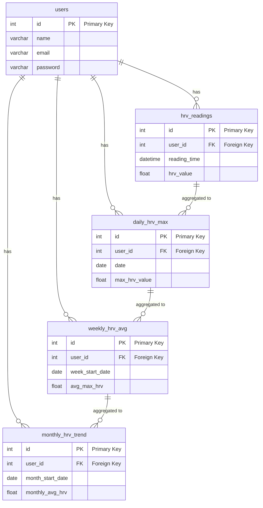

# MindMend

## Project initiation instructions

1.  check versions, needs Node version of at least 18

        node --version
        npm --version

2.  Install node modules for front- and backend

    for frontend:

        cd frontend
        npm install

    for backend:

        cd backend
        npm install

## General project structure

    MindMend/
    ├── frontend/
    ├── backend/
    ├── .gitignore
    ├── .prettierignore
    ├── .prettierrc.cjs
    ├── eslint.config.js
    └── README.md

## Detailed structure and documentation for both front- and backend

[Frontend documentation](frontend/README.md)

[Backend documentation](backend/README.md)

## Database

## Refrences and graphics libraries

Icons from [Lucide](https://lucide.dev/)

Sounds from [Freesound](https://freesound.org/)
