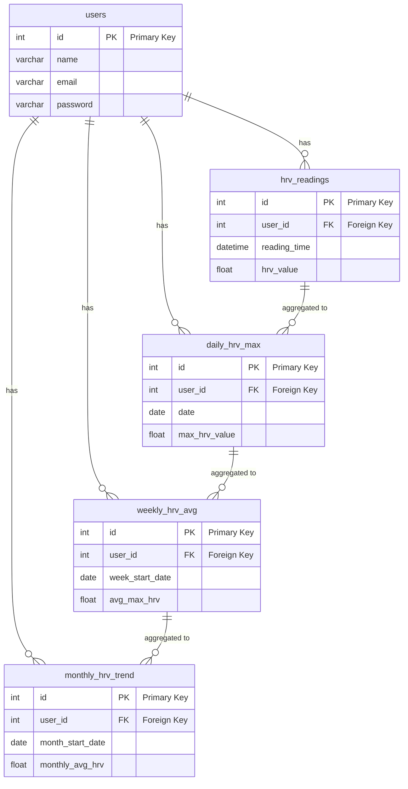

# Backend structure and documentation

## Folder structure

    backend/
    ├── package.json
    ├── .env
    ├── database/
    │   └── schema.sql
    └── src/
       ├── index.js
       ├── config/
       │   └── database.js
       ├── controllers/
       │   └── userController.js
       ├── models/
       │   └── userModel.js
       ├── routes/
       │   └── userRoutes.js
       ├── middleware/
       │   ├── auth.js
       │   └── errorHandler.js
       └── utils/
           ├── validators/
           │   └── userValidator.js
           └── database.js

## Initiation

1.  Install node modules if not already done

        cd backend
        npm install

2.  Start the server

        npm run dev

3.  Initialize the database

        source <filepath>

    And to make sure it's created correctly run:

        show tables;

    It should look something like this:

        +-----------------------+
        | Tables_in_mindmend    |
        +-----------------------+
        | hrv_readings          |
        | daily_hrv_max         |
        | weekly_hrv_avg        |
        | monthly_hrv_trend     |
        | users                 |
        +-----------------------+

## Database

