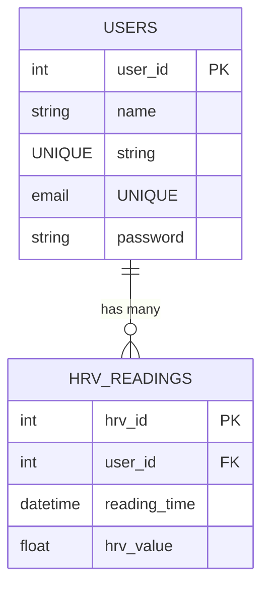

<div align="center">
   <h1>MindMend - Backend Documentation</h1>
   
</div>


Welcome to the **Backend** documentation of **MindMend**, a mental wellness and PTSD management application designed to help users manage stress and improve mental health through cutting-edge features like HRV monitoring and guided relaxation exercises.

---

## **Table of Contents**

1. [Introduction](#introduction)
2. [Links](#links)
3. [Folder Structure](#folder-structure)
4. [API Endpoints](#api-endpoints)
   - [User Endpoints](#1-user-endpoints)
   - [HRV Endpoints](#2-hrv-endpoints)
   - [Chat Endpoints](#3-chat-endpoints)
   - [Authentication](#authentication)
5. [Libraries and Tools](#libraries-and-tools)
6. [Known Issues](#known-issues)
7. [Database](#database)
8. [Setup instructions](#setup-instructions)


---

## Introduction

The backend of MindMend is built using Node.js, Express, and MySQL. It provides a RESTful API for the frontend to interact with the database and perform various operations related to user management, HRV data storage, and analysis.

---

## Links

- **Published Frontend Application**: [Mind-mend.live](https://mind-mend.live)
- **Backend API Service**: [Azure](https://mind-mend.azurewebsites.net/api)
- **Root README**: [Root README](../README.md)
- **Frontend Documentation**: [Frontend Documentation](../frontend/README.md)
- **Testing Documentation**: [Testing Documentation](../tests/README.md)
- **API Documentation**: [API Documentation](https://mind-mend.azurewebsites.net/api-docs)

---

## Folder structure

    backend/
    ├── package.json                    // Node.js package file
    ├── .env                            // Environment variables
    ├── database/
    │    └── schema.sql                 // SQL schema for the database
    └── src/
        ├── index.js                    // Entry point for the application
        ├── controllers/
        │   ├── chatController.js       // Chat controller for handling chat-related operations
        │   ├── hrvController.js        // HRV controller for handling HRV-related operations
        │   └── userController.js       // User controller for handling user-related operations
        ├── middleware/
        │    └── authentication.js      // Middleware for authentication
        ├── models/
        │    └── userModel.js           // User model for database interactions
        ├── routers/
        │   ├── chatRouter.js           // Chat router for handling chat-related routes
        │   ├── hrvRouter.js            // HRV router for handling HRV-related routes
        │   └── userRouter.js           // User router for handling user-related routes
        └── utils/
            ├── validators/
            │    └── userValidator.js   // User validator for validating user input
            └── database.js             // Database connection and configuration
---

## API Endpoints

**Base URL:** `https://mind-mend.azurewebsites.net/api`

All request/response bodies are JSON. Protected routes require `Authorization: Bearer <JWT>`.

The API endpoints are organized into three main categories: **1. User**, **2. HRV**, and **3. Chat**. Each category has its own set of routes and controllers to handle the respective operations.

---

### **1. User Endpoints**

All user endpoints are prefixed with `/api/users`.


#### 1.1 - Get All Users
- **GET** `/api/users/`
- **Description**: Retrieves a list of all registered users.


#### 1.2 - Register User
- **POST** `/api/users/auth/register`
- **Description**: Register a new user account
- **Request Body**:
  ```json
  {
    "name": "username",
    "email": "user@example.com",
    "password": "securepassword"
  }
  ```


#### 1.3 - Login User
- **POST** `/api/users/auth/login`
- **Description**: Authenticate a user and receive a JWT token
- **Request Body**:
  ```json
  {
    "email": "user@example.com",
    "password": "securepassword"
  }
  ```


#### 1.4 - Change Password
- **POST** `/api/users/auth/change-password`
- **Description**: Change the password for a user account
- **Authorization**: Required
- **Request Body**:
  ```json
  {
    "userId": 1,
    "currentPassword": "oldpassword",
    "newPassword": "newpassword"
  }
  ```


#### 1.5 - Get User Profile
- **GET** `/api/users/profile/:userId`
- **Description**: Retrieve a user's profile information
- **Authorization**: Required (must be the user or admin)


#### 1.6 - Delete User
- **DELETE** `/api/users/auth/delete/:userId`
- **Description**: Delete a user account
- **Authorization**: Required (must be the user or admin)

---


### **2. HRV Endpoints**

All HRV endpoints are prefixed with `/api/hrv`.

#### 2.1 - Add HRV Reading
- **POST** `/api/hrv/`
- **Description**: Store a new HRV reading for a user
- **Authorization**: Required
- **Request Body**:
  ```json
  {
    "userId": 1,
    "hrvValue": 85.5,
    "readingTime": "2025-05-07T01:30:00Z"
  }
  ```


#### 2.2 - Get HRV Readings
- **GET** `/api/hrv?userId=1&startDate=2025-05-01&endDate=2025-05-07`
- **Description**: Retrieve HRV readings for a specific user within a date range
- **Authorization**: Required (must be the user or admin)
- **Query Parameters**:
  - `userId`: The user ID to fetch readings for (required)
  - `startDate`: The start date for filtering readings (optional)
  - `endDate`: The end date for filtering readings (optional)

---


### 3. Chat Endpoints

All chat endpoints are prefixed with `/api/chat`.

#### 3.1 - Send Chat Message
- **POST** `/api/chat/`
- **Description**: Process a user's message to the AI chat assistant
- **Authorization**: Required
- **Request Body**:
  ```json
  {
    "userId": 1,
    "message": "I'm feeling stressed right now"
  }
  ```


### Authentication

The API uses JSON Web Tokens (JWT) for authentication. Most endpoints require a valid JWT token to be included in the Authorization header. The token is obtained upon successful login.

- **Token Format**: `Bearer YOUR_TOKEN_HERE`
- **Token Expiration**: 24 hours
- **Protected Routes**: Most routes require authentication except for registration and login

---

## Libraries and Tools

The MindMend backend utilizes the following libraries and tools:

- **Express.js**: Web framework for building the API
- **MySQL**: Database for storing user data and HRV readings
- **bcryptjs**: Library for hashing and comparing passwords
- **jsonwebtoken**: Library for generating and verifying JWT tokens
- **dotenv**: Library for loading environment variables
- **cors**: Middleware for enabling CORS
- **helmet**: Middleware for securing HTTP headers
- **morgan**: HTTP request logger middleware
- **nodemon**: Development tool for automatically restarting the server on file changes

---

## Known Issues

- We are not storing tetris score currently, but we are planning to add this feature in the future. (It didn't feel necessary for the time being)
- The JWT token expiration is set to 24 hours, which may need to be adjusted based on security requirements.
- Rate limiting has not been implemented yet, which could be a security concern for high-traffic applications.

---

## Database

The database for MindMend. Below is the schema for the `users` and `hrv_readings` tables, represented using Mermaid markup:


### Note on Database Simplicity

The database structure of MindMend is intentionally simple, adhering to the "keep it simple" philosophy, which avoids unnecessary complexity while meeting all functional requirements.


---

## Setup instructions

First setup the frontend of MindMend by following the instructions in the [Frontend README](../frontend/README.md).

Then, set up the backend by following these instructions:

### Prerequisites

- Node.js (v14 or higher)
- MySQL (v8.0 or higher)
- npm or yarn package manager

### Environment Setup

1. Clone the repository if you haven't already
   ```
   git clone https://github.com/oliverhazley/MindMend.git
   cd MindMend
   ```

2. Create a `.env` file in the backend directory with the following variables:
   ```
   DB_HOST=localhost
   DB_USER=yourusername
   DB_PASSWORD=yourpassword
   DB_NAME=mindmend
   JWT_SECRET=your_jwt_secret_key
   OPENAI_API_KEY=your_openai_api_key
   ```

### Installation

1. Install node modules if not already done
   ```
   cd backend
   npm install
   ```

2. Start the server
   ```
   npm run dev
   ```

3. Initialize the database
   ```
   mysql -u yourusername -p
   ```
   Then within the MySQL prompt:
   ```
   source database/schema.sql;
   ```

   And to make sure it's created correctly run:
   ```
   show tables;
   ```

   It should look something like this:
   ```
   +-----------------------+
   | Tables_in_mindmend    |
   +-----------------------+
   | hrv_readings          |
   | users                 |
   +-----------------------+
   ```

### Testing the API

After setting up, you can test the API endpoints using postman or any other API testing tool. The base URL for the API is `http://localhost:3000/api`.
