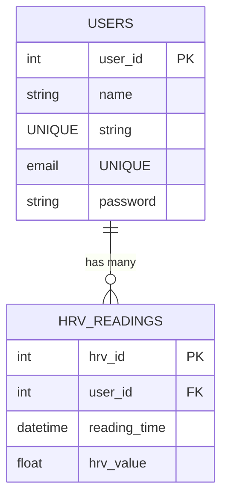

<div align="center">
   <h1>MindMend - Backend Documentation</h1>
   
</div>

Welcome to the **Backend** documentation of **MindMend**, a mental wellness and PTSD management application designed to help users manage stress and improve mental health through cutting-edge features like HRV monitoring and guided relaxation exercises.

---

## Table of Contents

1. [Introduction](#introduction)
2. [Links](#links)
3. [Folder Structure](#folder-structure)
4. [API Endpoints](#api-endpoints)
5. [Database](#database)
6. [Libraries and Tools](#libraries-and-tools)
7. [Known Issues](#known-issues)
8. [Setup instructions](#setup-instructions)

---

## Introduction

The backend of MindMend is built using Node.js, Express, and MySQL. It provides a RESTful API for the frontend to interact with the database and perform various operations related to user management, HRV data storage, and analysis.

---

## Links

- **Published Frontend Application**: [Mind-mend.live](https://mind-mend.live)
- **Backend API Service**: [Azure](https://mind-mend.azurewebsites.net/api)
- **API Documentation**: [API Documentation](https://mind-mend.azurewebsites.net/api-docs)
- **Frontend README**: [Frontend-specific Documentation](../frontend/README.md)
- **Testing README**: [Testing-specific Documentation](../tests/README.md)

---

## Folder structure

    backend/
    ├── package.json                    // Node.js package file
    ├── .env                            // Environment variables
    ├── database/
    │    └── schema.sql                 // SQL schema for the database
    └── src/
        ├── index.js                    // Entry point for the application
        ├── controllers/
        │   ├── chatController.js       // Chat controller for handling chat-related operations
        │   ├── hrvController.js        // HRV controller for handling HRV-related operations
        │   └── userController.js       // User controller for handling user-related operations
        ├── middleware/
        │    ├── authentication.js      // Middleware for authentication
        │    └── authorization.js       // Middleware for authorization
        ├── models/
        │    ├── hrvModel.js            // HRV model for database interactions
        │    └── userModel.js           // User model for database interactions
        ├── routers/
        │   ├── chatRouter.js           // Chat router for handling chat-related routes
        │   ├── hrvRouter.js            // HRV router for handling HRV-related routes
        │   └── userRouter.js           // User router for handling user-related routes
        └── utils/
            ├── validators/
            │    └── userValidator.js   // User validator for validating user input
            └── database.js             // Database connection and configuration

---

## API Endpoints

**Base URL:** `https://mind-mend.azurewebsites.net/api`

The API endpoints are organized into three main categories: **1. User**, **2. HRV**, and **3. Chat**. Each category has its own set of routes and controllers to handle the respective operations.

**[Detailed API documentation can be found here](https://mind-mend.azurewebsites.net/api-docs)**

## Database

The database for MindMend. Below is the schema for the `users` and `hrv_readings` tables, represented using Mermaid markup:



### Note on Database Simplicity

The database structure of MindMend is intentionally simple, adhering to the "keep it simple" philosophy, which avoids unnecessary complexity while meeting all functional requirements.

---

## Libraries and Tools

The MindMend backend utilizes the following libraries and tools:

- **Express.js**: Web framework for building the API
- **MySQL**: Database for storing user data and HRV readings
- **bcryptjs**: Library for hashing and comparing passwords
- **jsonwebtoken**: Library for generating and verifying JWT tokens
- **dotenv**: Library for loading environment variables
- **cors**: Middleware for enabling CORS
- **nodemon**: Development tool for automatically restarting the server on file changes

---

## Known Bugs/Issues

- We are not storing tetris score currently, but we are planning to add this feature in the future. (It didn't feel necessary for the time being)
- The JWT token expiration is set to 24 hours, which may need to be adjusted based on security requirements.
- Rate limiting has not been implemented yet, which could be a security concern for high-traffic applications.

## Setup instructions

First setup the frontend of MindMend by following the instructions in the [Frontend README](../frontend/README.md).

Then, set up the backend by following these instructions:

### Prerequisites

- Node.js (v14 or higher)
- MySQL (v8.0 or higher)
- npm or yarn package manager

### Environment Setup

#### 1. Clone the repository if you haven't already

```
git clone https://github.com/oliverhazley/MindMend.git
cd MindMend
```

#### 2. Create a `.env` file in the backend directory with the following variables:

```
DB_HOST=localhost
DB_USER=yourusername
DB_PASSWORD=yourpassword
DB_NAME=mindmend
JWT_SECRET=your_jwt_secret_key
OPENAI_API_KEY=your_openai_api_key
```

### Installation

#### 1. Install node modules if not already done

```
cd backend
npm install
```

#### 2. Start the server

```
npm run dev
```

#### 3. Initialize the database

```
mysql -u yourusername -p
```

Then within the MySQL prompt:

```
source database/schema.sql;
```

And to make sure it's created correctly run:

```
show tables;
```

It should look something like this:

```
+-----------------------+
| Tables_in_mindmend    |
+-----------------------+
| hrv_readings          |
| users                 |
+-----------------------+
```

### Testing the API

After setting up, you can test the API endpoints using postman or any other API testing tool. The base URL for the API is `http://localhost:3000/api`.
