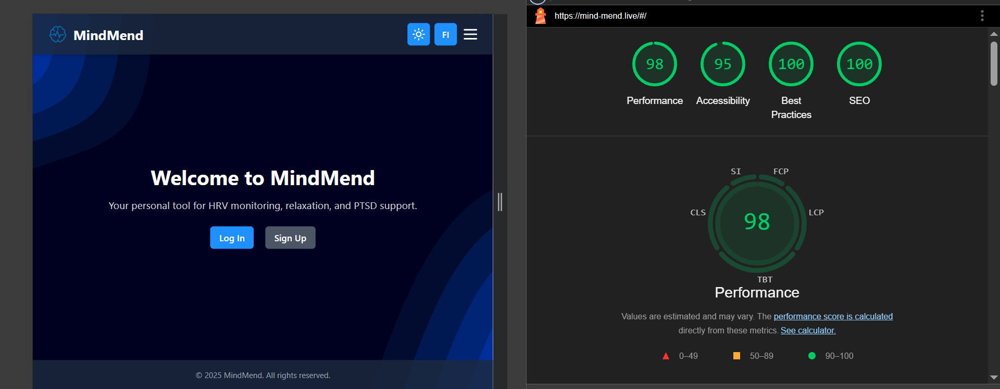

<div align="center">
   <h1>MindMend - Frontend Documentation</h1>
   
</div>


Welcome to the **Frontend** documentation of **MindMend**, a mental wellness and PTSD management application designed to help users manage stress and improve mental health through cutting-edge features like HRV monitoring and guided relaxation exercises.

---

## **Table of Contents**

1. [Introduction](#1-introduction)
2. [Links](#2-links)
3. [Folder Structure](#3-folder-structure)
4. [Core Features](#4-core-features)
5. [RMSSD Calculation Logic](#5-rmssd-calculation-logic)
6. [Libraries and Tools](#6-libraries-and-tools)
7. [Known Issues](#7-known-issues)
8. [References](#8-references)
8. [Lighthouse](#9-lighthouse)
10. [SEO](#10-seo)
11. [Prototype](#11-Prototype)
12. [Setup Instructions](#12-Setup-instructions)

---

## **1. Introduction**

MindMend's frontend serves as the user interface for the application. It is designed to be intuitive, responsive, and visually appealing, providing seamless access to the app's functionalities.

---

## **2. Links**

- **Published Frontend Application**: [Mind-mend.live](https://mind-mend.live)
- **Backend API Service**: [Azure](https://mind-mend.azurewebsites.net/api)
- **Root README**: [MindMend README](../README.md)  
- **Backend Documentation**: [Backend README](../backend/README.md)  
- **Testing Documentation**: [Testing README](../tests/README.md)  
- **API Documentation**: [API Documentation]()

---


## **3. Folder Structure**

We use a modular approach to our frontend code. The main logic is divided into separate JavaScript files, each handling a specific functionality. This makes the codebase easier to maintain and extend.

The frontend is built using Vite, a fast build tool that provides a modern development experience. We use Tailwind CSS for styling, which allows us to create responsive and visually appealing designs with minimal effort. We built with a mobile-first approach in mind, ensuring that the application works seamlessly on mobile devices.
We also use PostCSS for processing CSS, and we have a configuration file for Tailwind CSS to customize the design system.

The frontend is structured as a Single Page Application (SPA) using JavaScript for dynamic content loading and routing. The main entry point is `index.html`, which loads the necessary JavaScript and CSS files.
We had to create a SPA so that we would not lose bluetooth connection when navigating between pages. This was a big issue during our user testing, and we had to find a solution. We used the `router.js` file to handle the routing logic. The router.js file is responsible for loading the correct JavaScript files based on the current URL hash.

The frontend is organized as follows:


    frontend/
    ├── index.html            // Main HTML file (Heart and Soul)
    ├── .env                  // Environment variables
    ├── README.md             // This file
    ├── package.json          // Node.js dependencies
    ├── package-lock.json     // Node.js dependencies
    ├── vite.config.js        // Vite configuration
    ├── tailwind.config.js    // Tailwind CSS
    ├── postcss.config.js     // PostCSS
    ├── robots.txt            // SEO
    ├── sitemap.xml           // SEO   
    ├── manifest.json         // SEO
    ├── src/                        
    │   ├── scripts/                    // JavaScript files
    │   │   ├── chat.js                 // Chatbot logic
    │   │   ├── config.js               // Configuration file for API
    │   │   ├── dashboard.js            // Dashboard logic
    │   │   ├── exercises.js            // Meditation exercises logic
    │   │   ├── ExportData.js           // Export data logic
    │   │   ├── i18n.js                 // Localization
    │   │   ├── info.js                 // Info section logic
    │   │   ├── login.js                // Login logic
    │   │   ├── logout.js               // Logout logic
    │   │   ├── main.js                 // Miscellaneous logic - initialization for important things
    │   │   ├── navbar.js               // Navbar logic
    │   │   ├── polarConnect.js         // Polar H10 connection logic
    │   │   ├── router.js               // Router logic - Very important for our SPA
    │   │   ├── settings.js             // Settings logic
    │   │   ├── signup.js               // Signup logic
    │   │   └── tetris.js               // Tetris game logic
    │   └── styles/                 
    │       └── tailwind.css            // Tailwind CSS file
    └── public/                    
        ├── images/                     
        │   ├── bg1.webp                // Default background (darkmode)
        │   ├── bgLight.webp            // Light mode background
        │   └── mmlogo.webp             // MindMend logo
        ├── locales/
        │   ├── en.json                 // English translations
        │   └── fi.json                 // Finnish translations
        └── sounds/
            ├── fire.mp3                // Fire sound for meditation
            ├── rain.mp3                // Rain sound for meditation
            └── stream.mp3              // Stream sound for meditation


---

## 4. Core Features


### 4.1. **Landing page**

   A stylish landing page with a background (SVG converted to webp) and a brief description of the app. We have buttons to log in or sign up. Since its a SPA (Single page application), We hide our protected routes with a simple if statement in the main.js file. The landing page is also responsive and works on mobile devices.


---

### 4.2. **Theme toggle**

   The user can toggle between light and dark mode. The theme is saved in local storage. Default is dark mode. Fully mobile responsive. We have a seperate webp image for the light mode background. The user can change themes by pressing the Sun (light) or Moon (dark) icon in the navbar. Changes to styling are made in the tailwind.css file via: 
    
    body.light-mode .id


---

### 4.3. **Localization (Language selection)**

   The user can select between English and Finnish. The default is English. The language is saved in local storage. We use a i18n.js file to handle the translations. The translations are stored in json files in the locales folder. The user can select the language via a dropdown menu in the navbar. The translations are done using the i18n library. The translations are stored in json files in the locales folder. The user can select the language by pressing the "EN / FI" button in the navbar.


---

### 4.4. **Login & Registration**

The user can log in via email and password. The user can register via email, password and name. We check for duplicate emails in the database. We check to make sure the passwords match. Logging in will create a JWT key.


--- 

### 4.5. **HRV Monitoring (dashboard)**

   Once the user has logged in, or a JWT key is in storage, the user is redirected to the dashboard. The user can connect to the Polar H10 heart rate monitor via Web Bluetooth. The dashboard shows HRV data in various forms, including - Live pulse, RMSSD, and RR intervals, aswell as data trends taken from the database, and calulcated in our dashboard.js logic.
We used chart.js to create the graphs. The dashboard is fully responsive and works on mobile devices. This is essentially the heart and soul of our application. Live, Realtime data being collected and calculated for the user.

Disclaimer: The Polar H10 connection does not work on Apple devices due to Safari's requirement for the WebKit API, which does not support Web Bluetooth. The connection works on Android devices and Windows computers.
   


--- 

### 4.6. **Meditation**

On our meditation page, the user can activate different sounds and complete relaxation exercises. The user can also complete breathing exercises. They have access to their current Pulse and RMSSD values while doing the exercises. The content of this page is filled via javascript, in a modular fashion.
This means, we can easily add more content in the future.


---

### 4.7. **Tetris**

The user can play a relaxing game of Tetris. The game is fully responsive and works on mobile devices. The game is simple with no sound or music. 

The gameplay logic was mostly built by ChatGPT with a few small tweaks (We didn't want to spend our time working on it, since it wasn't the main focus of the project). Styling was done by us to fit our theme.

The user can use their keyboard arrow keys to move the pieces, and mobile they can swipe. There is a score, but it is not saved anywhere, This could be added in future - if we want to keep working on the project (a highscore table would be a nice addition, but again, this wasn't the focus of our project).
The player can start a game, pause a game, or restart there game. On game over, the user receives a "Game Over" popup notification.


---

### 4.8. **MindMend Chatbot**

The chatbot runs via OpenAI's API, we are using the gpt-3.5-turbo model. Its fully responsive and works on mobile devices.

Our chatbot can answer questions about the app, stress, coping techniques, and general mental health. We have tried to train it **not** to answer stupid or **off topic** questions, but if you try hard enough, you can "jailbreak" it. (it's a work in progress). We are very pleased with how it acts though. If the user has questions that fall outside the role of support (something serious) it prompts the user to contact a professional.

The chatbot supports both english and finnish, however currently it will sometimes respond in english even if the user is using finnish. We are working on this issue.

We also attempted to train the bot on the apps structure, in order to help users find features within the app - this was succesful to an extent. (We chose to do this because during our user testing, some users had difficulties finding features, like - Exporting data to a therapist) - we plan to refine this in the future.


---

### 4.9. **Info Section**

Our info sections contains basic information about the app, how it helps, what HRV is, and why its relevant to ptsd. It has "Accordian" functionality. The user can open and close the different info boxes. 

It also contains instructions on how to export data for a therapist (During our user testing, numerous testers had difficulties finding the export feature. so we added a tidbit to help them.)


---

### 4.10. **Profile**

In our profile section, the user can view their name & email. They can change their password, and even delete their account.

We also have secondary buttons here to connect to the Polar-H10, and to export data for a therapist. (This is because of the issues we discovered during our user testing).


---

### 4.11. **Logging out**

Our logout button is situated in our navbar - Clicking it takes the user back to the landing page. When a user logs out, it clears the JWT key from local storage, along with their user_id and catched HRVdata.


---

### 4.12. **Device connection & realtime data visualization**

To connect to the Polar-H10 device, the user needs to press the **Connect** button on the dashboard, or the profile section (Bluetooth must be enabled). After pressing connect, This will display a list of avalible devices. The user should select their device and press pair.

After pairing the device our interface will show "Connecting..." and then "Connected" once its successfully connected. The user can then view their realtime data on the dashboard. The data is displayed in a graph, and the user can see their current pulse, RMSSD, and RR intervals (Realtime data).

This data is saved to the database, and the user can view their data trends at the bottom of the dashboard. The data is saved every 3 minutes, and the user can view their data for the last 24 hours, 7 days, 30 days or 365 days. There is a filter above the **Trend** displays.

The connection uses the Web Bluetooth API, which allows web applications to connect to Bluetooth devices. The connection is established using the `navigator.bluetooth.requestDevice` method, which prompts the user to select a Bluetooth device. Once the device is selected, we use the `gatt.connect()` method to establish a connection.
(Unfortunately this does not work on Apple devices due to Safari's requirement for the WebKit API, which does not support Web Bluetooth.)


---

### 4.13. **PDF export**

The user can export their HRV data to a PDF file. The PDF contains a summary of HRV trend data. The PDF is generated using the jsPDF library.


---

##  **5. RMSSD Calculation Logic**

Our app calculates **Heart Rate Variability (HRV)** using the **RMSSD (Root Mean Square of Successive Differences)** method, which is a widely accepted time-domain HRV metric. Here's how it works:

###  5.1. Correct RMSSD Formula

We use the standard formula:

    RMSSD = √(1 / (N - 1) * Σ(RRₙ₊₁ - RRₙ)²)

Where:
- `RRₙ` = time between two heartbeats (RR intervals, in milliseconds)
- `N` = total number of RR intervals

This is implemented in our `calculateRMSSD()` function.

---

### 5.2. Artifact Filtering

To ensure data quality, we apply a **median filter with a deviation threshold** before calculating RMSSD. This helps remove outliers caused by:
- Motion artifacts
- Missed beats
- Bluetooth packet issues

The algorithm checks if each RR interval deviates too far from the local median (default: ±150 ms) and replaces it when necessary.

---

### 5.3. Buffering for Stability

We wait for a **3-minute buffering period** before starting RMSSD calculations. This allows the system to:
- Accumulate enough clean RR data
- Avoid unstable initial readings
- Establish a stable baseline for HRV

---

### 5.4. Sliding Window Mechanism

After the initial 3-minute period:
- We maintain a **sliding buffer** of recent RR intervals (e.g. last 256 samples)
- Old samples are removed as new ones arrive
- This ensures the RMSSD reflects **real-time autonomic state** without being overly sensitive

---

### 5.5. Data Validation Before Upload

Before saving the RMSSD to the backend:
- We **ensure there are enough RR samples**
- We **filter out invalid or infinite values**
- RMSSD is rounded and only uploaded if it’s valid

This helps keep the database clean and the analysis meaningful.

---

## **6. Libraries and Tools**

### Frontend Libraries
- **Tailwind CSS**: Utility-first CSS framework for styling.
- **Chart.js**: Data visualization library.
- **jspdf**: For generating PDFs from HRV data.
- **Web Bluetooth**: For connecting to Polar H10 heart rate monitor.
- **Lucide Icons**: Icon library for UI components.

### Development Tools
- **Vite**: Fast frontend build tool.
- **PostCSS**: CSS processing tool.
- **ESLint & Prettier**: For linting and code formatting.
- **Git**: Version control system.
- **Node.js**: JavaScript runtime for development and build processes.
- **npm**: Package manager for JavaScript.
- **netlify**: For deploying the frontend application.


---


### 7. Known Issues
- **Polar H10 Connection**: Does not work on Apple devices due to Safari's requirement for the WebKit API, which does not support Web Bluetooth.
- **Chatbot Language**: Sometimes responds in English even if the user is using Finnish.
- **RMSSD Calculation**: The RMSSD calculation is not always accurate due to the nature of the data being collected. We are working on improving the filtering and calculation methods.


---


## **8. References**

- Icons from [Lucide](https://lucide.dev/)
- Sounds from [Freesound](https://freesound.org/)
- SVG backgrounds generated with [Haikei](https://haikei.app)
- Frontend Framework: Tailwind CSS
- Backend Framework: Node.js with Express.js
- Database: MariaDB MySQL
- Data visualization [Chart.js](https://www.chartjs.org/)
- Web Bluetooth API for connecting to Polar H10
- Testing [Robot Framework](https://robotframework.org/)
- Stack overflow for bug fixing, help with various issues
- ChatGPT for bug fixing, and help with various issues
- Claude for bug fixing, and help with various issues


---


## **9. Lighthouse**

We are very happy with this lighthouse score. We have a 100% SEO score, 100% best practices, 95% accessability, and 98% on Performance. 




--- 


## **10. SEO**

For SEO we are using a robots.txt file, a sitemap.xml file, and a manifest.json file. We also have a favicon and a logo. We are using the Open Graph protocol for social media sharing. We are using the Twitter Card protocol for Twitter sharing. We are using the Schema.org protocol for structured data.


---


## **11. Prototype**

We didn't deviate much from our planned prototype. The changes we **did** make were mostly artistic choices. Minor features were added
due to our user testing. As mentioned in earlier sections, we added a few features to help users find the export feature, and to help them connect to the Polar-H10 device.

A link to our prototype can be found below. This acted as our wireframe.

[Prototype link](https://mind-mend.netlify.app/)

Disclaimer: This prototype was built with react, using components oliver had ready made, it was thrown together in a few days during our 
research and documentation phase. We didn't see the need to create a figma prototype, as it felt faster to piece this together with the ready components.


---


## **12. Setup Instructions**

If you would like to run this project locally, please follow the instructions below. 

Start with: 

1. Ensure you have the required Node.js version (>=18):
   ```bash
   node --version
   npm --version


---


## **Initiation**

The instructions below will help you set up the frontend of the MindMend application on a local machine. You will need a Polar-H10 device to get the full functionality of the application.

1.  Install node modules if not already done

        cd frontend
        npm install

2.  You will need to set up a .env file in the frontend directory with the following content:

        VITE_API_BASE_URL=http://localhost:3000/api

3.  Start the server

        npm run dev


4. You will then need to setup the backend
   - Follow the instructions in the [Backend README](../backend/README.md) to set up the backend server and database.
        

### Test User Credentials (for hosted build)

| Email             | Password |
|-------------------|----------|
| test123@gmail.com | test123  |

---
