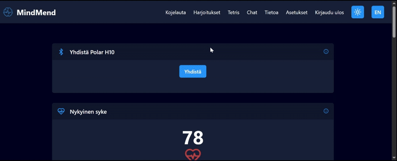

<div align="center">
   <h1>MindMend - Frontend Documentation</h1>
   
</div>


Welcome to the **Frontend** documentation of **MindMend**, a mental wellness and PTSD management application designed to help users manage stress and improve mental health through cutting-edge features like HRV monitoring and guided relaxation exercises.

---

## Table of Contents

1. [Introduction](#introduction)
2. [Links](#links)
3. [Core Features](#core-features)
4. [Project Structure](#project-structure)
5. [Libraries and Tools](#libraries-and-tools)
6. [Known Issues](#known-issues)
7. [References](#references)
8. [Setup Instructions](#setup-instructions)

---

## Introduction

MindMend's frontend serves as the user interface for the application. It is designed to be intuitive, responsive, and visually appealing, providing seamless access to the app's functionalities.

---

## Links

- **Root README**: [MindMend README](../README.md)  
- **Backend Documentation**: [Backend README](../backend/README.md)  
- **Testing Documentation**: [Testing README](../tests/README.md)  

---

## Core Features


### 1. **Landing page**
   A stylish landing page with a background (SVG converted to webp) and a brief description of the app. We have buttons to log in or sign up. Since its a SPA (Single page application), We hide our protected routes with a simple if statement in the main.js file. The landing page is also responsive and works on mobile devices.


### 2. **Theme toggle**
   The user can toggle between light and dark mode. The theme is saved in local storage. Default is dark mode. Fully mobile responsive. We have a seperate webp image for the light mode background. The user can change themes by pressing the Sun (light) or Moon (dark) icon in the navbar. Changes to styling are made in the tailwind.css file via: 
    
    body.light-mode .id


### 2. **Localization (Language selection)**
   The user can select between English and Finnish. The default is English. The language is saved in local storage. We use a i18n.js file to handle the translations. The translations are stored in json files in the locales folder. The user can select the language via a dropdown menu in the navbar. The translations are done using the i18n library. The translations are stored in json files in the locales folder. The user can select the language by pressing the "EN / FI" button in the navbar.


### 3. **Login & Registration**
The user can log in via email and password. The user can register via email, password and name. We check for duplicate emails in the database. We check to make sure the passwords match. Logging in will create a JWT key.


### 4. **HRV Monitoring (dashboard)**
   Once the user has logged in, or a JWT key is in storage, the user is redirected to the dashboard. The user can connect to the Polar H10 heart rate monitor via Web Bluetooth. The dashboard shows HRV data in various forms, including - Live pulse, RMSSD, and RR intervals, aswell as data trends taken from the database, and calulcated in our dashboard.js logic.
We used chart.js to create the graphs. The dashboard is fully responsive and works on mobile devices. 

Disclaimer: The Polar H10 connection does not work on Apple devices due to Safari's requirement for the WebKit API, which does not support Web Bluetooth. The connection works on Android devices and Windows computers.
   



### 2. **Relaxation Exercises**
   Engage in mindfulness and breathing exercises with audio guidance.
   - 

### 3. **Tetris Game**
   Play a relaxing game of Tetris for distraction.
   - 

### 4. **Responsive Design**
   Optimized for both desktop and mobile platforms.
   - 

### 5. **User Authentication**
   Secure login and registration system.
   - 

---

## Project Structure

The frontend is organized as follows:


    frontend/
    ├── index.html
    ├── .env
    ├── README.md
    ├── package.json
    ├── package-lock.json
    ├── vite.config.js
    ├── tailwind.config.js
    ├── postcss.config.js
    ├── src/
    │   ├── scripts/
    │   │   ├── chat.js
    │   │   ├── config.js
    │   │   ├── dashboard.js
    │   │   ├── exercises.js
    │   │   ├── ExportData.js
    │   │   ├── i18n.js
    │   │   ├── info.js
    │   │   ├── login.js
    │   │   ├── logout.js
    │   │   ├── main.js
    │   │   ├── navbar.js
    │   │   ├── polarConnect.js
    │   │   ├── router.js
    │   │   ├── settings.js
    │   │   ├── signup.js
    │   │   └── tetris.js
    │   └── styles/
    │       └── tailwind.css
    └── public/
        ├── images/
        │   ├── bg1.webp
        │   ├── bgLight.webp
        │   └── mmlogo.webp
        ├── locales/
        │   ├── en.json
        │   └── fi.json
        └── sounds/
            ├── fire.mp3
            ├── rain.mp3
            └── stream.mp3


---

## Libraries and Tools

### Frontend Libraries
- **Tailwind CSS**: Utility-first CSS framework for styling.
- **Chart.js**: Data visualization library.
- **jspdf**: For generating PDFs from HRV data.
- **Web Bluetooth**: For connecting to Polar H10 heart rate monitor.
- **Lucide Icons**: Icon library for UI components.

### Development Tools
- **Vite**: Fast frontend build tool.
- **PostCSS**: CSS processing tool.
- **ESLint & Prettier**: For linting and code formatting.
- **Git**: Version control system.
- **Node.js**: JavaScript runtime for development and build processes.
- **npm**: Package manager for JavaScript.
- **netlify**: For deploying the frontend application.

---


### Known Issues
- **Polar H10 Connection**: Does not work on Apple devices due to Safari's requirement for the WebKit API, which does not support Web Bluetooth.

---

## References

- Icons from [Lucide](https://lucide.dev/)
- Sounds from [Freesound](https://freesound.org/)
- SVG backgrounds generated with [Haikei](https://haikei.app)
- Frontend Framework: Tailwind CSS
- Backend Framework: Node.js with Express.js
- Database: MariaDB MySQL
- Data visualization [Chart.js](https://www.chartjs.org/)
- Web Bluetooth API for connecting to Polar H10
- Testing [Robot Framework](https://robotframework.org/)
- Stack overflow for bug fixing, help with various issues
- ChatGPT for bug fixing, and help with various issues
- Claude for bug fixing, and help with various issues

---


## Setup Instructions

1. Ensure you have the required Node.js version (>=18):
   ```bash
   node --version
   npm --version


---

## Initiation

The instructions below will help you set up the frontend of the MindMend application on a local machine.

1.  Install node modules if not already done

        cd frontend
        npm install

2.  Start the server

        npm run dev

3.  You will need to set up a .env file in the frontend directory with the following content:

        VITE_API_BASE_URL=http://localhost:3000/api

4. You will then need to setup the backend
   - Follow the instructions in the [Backend README](../backend/README.md) to set up the backend server and database.
        

## Test User Credentials (for hosted build)

| Email             | Password |
|-------------------|----------|
| test123@gmail.com | test123  |

---